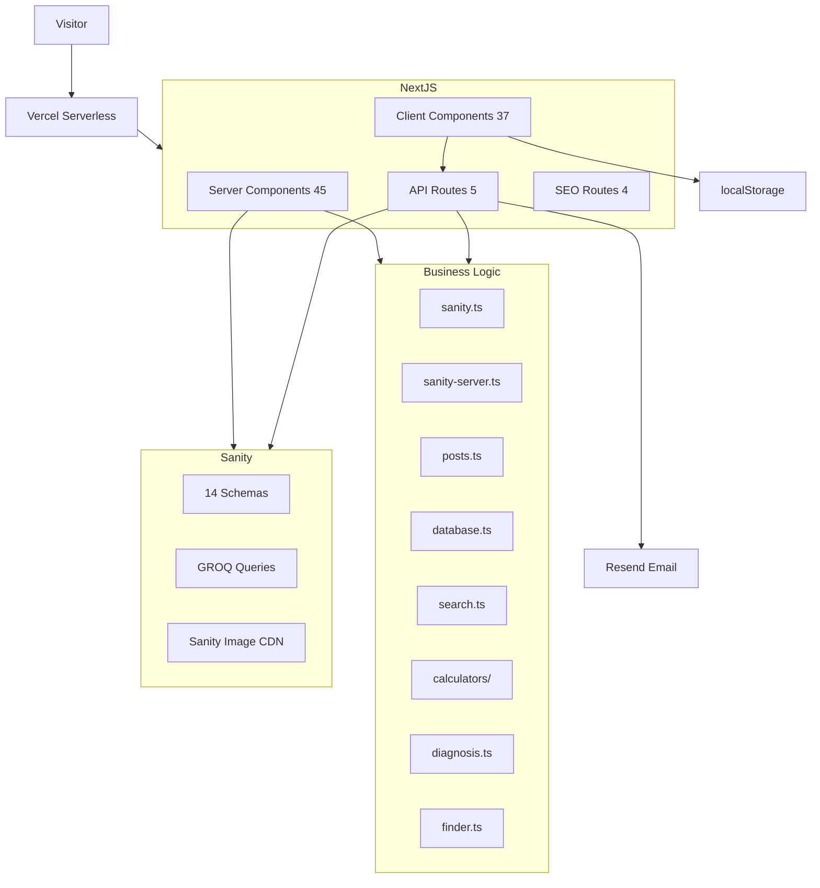

# Aqua Blog — Current State

## 1. Executive Summary

Aqua Blog (AquaMind) is a production aquascaping/aquarium content platform. It is a **Next.js 15 App Router** application with **Sanity v3** as the headless CMS, **Tailwind CSS 3** for styling, and **Vercel** as the deployment target.

The site contains **46 page routes** across blog articles, 5 species/plant/coral/equipment/invertebrate databases, 12 interactive calculator tools, a species finder quiz, a setup planner, learning paths, aquascaping style guides, a problem diagnostic wizard, and a wiki hub.

**45 page files** are all Server Components. Client interactivity is delegated to **37 client components** via `"use client"` directive. The project has **24 test files** with Vitest (1 failing test out of 238). ESLint passes cleanly.

**Key current gaps**: No scroll reveal/entrance animations, no page transitions, no Framer Motion, no analytics, no i18n framework, no service worker registration working, Studio is unprotected, no `loading.tsx` at route level, and no error boundaries.

---

## 2. Project Identity

| Item | Value |
|---|---|
| Project name | aqua_mind_blog |
| Framework | Next.js 15.5.22 |
| Language | TypeScript 5.9.3 |
| Package Manager | npm 10.9.2 |
| Node.js | v22.17.0 |
| CMS | Sanity 3.99.0 |
| Deployment | Vercel (implied) |
| Hosting | Vercel |
| Analytics | **None detected** |
| Image hosting | Sanity CDN (cdn.sanity.io) |
| CSS | Tailwind CSS 3.4.19 |
| Icons | lucide-react 1.27.0 |
| Test Framework | Vitest 4.1.10 |
| Linting | ESLint 8.57.1 + eslint-config-next 14.2.6 |
| Git Branch | `main` |
| Git Status | Clean (only `báo_cao.md` untracked) |

---

## 3. Tech Stack

| Layer | Technology | Version | Status |
|---|---|---|---|
| Framework | Next.js | 15.5.22 | Active |
| Language | TypeScript | 5.9.3 | Active |
| UI Library | React | 19.2.8 | Active |
| CSS Framework | Tailwind CSS | 3.4.19 | Active |
| CMS | Sanity | 3.99.0 | Active |
| CMS Integration | next-sanity | 9.12.3 | Active |
| Sanity Client | @sanity/client | 7.25.0 | Active |
| Image URL | @sanity/image-url | 2.1.1 | Active |
| Icons | lucide-react | 1.27.0 | Active |
| Test Framework | Vitest | 4.1.10 | Active |
| Testing Lib | @testing-library/react | 16.3.2 | Active |
| DOM Testing | jsdom | 29.1.1 | Active |
| Linter | ESLint | 8.57.1 | Active |
| Lint Config | eslint-config-next | 14.2.6 | Active |
| Email | Resend | API | Active (newsletter) |
| PWA | Service Worker | Custom route | Registered (sw.js route) |
| Fonts | Inter + Playfair Display | next/font/google | Active |
| Animation Libraries | **None** | — | NOT IMPLEMENTED |
| Framer Motion / GSAP | **None** | — | NOT IMPLEMENTED |

---

## 4. Source Structure

```
aqua_mind_blog/
├── app/                          # Next.js App Router (97 files)
│   ├── layout.tsx                # Root layout (fonts, navbar, footer, SEO)
│   ├── page.tsx                  # Home page
│   ├── loading.tsx               # Root loading state
│   ├── not-found.tsx             # 404 page
│   ├── globals.css               # Global styles + Tailwind
│   ├── manifest.ts               # PWA manifest
│   ├── robots.ts                 # Robots.txt
│   ├── sitemap.ts                # Dynamic sitemap
│   ├── favicon.ico               # Favicon
│   ├── apple-icon.png            # Apple icon
│   ├── icon.png                  # Generic icon
│   ├── logo.png                  # Logo
│   ├── components/               # Shared UI components (43 files)
│   │   ├── navbar.tsx            # Sticky nav (client)
│   │   ├── footer.tsx            # Footer (client)
│   │   ├── PortableText.tsx      # Rich text renderer (server)
│   │   ├── PostCard.tsx          # Blog card (server)
│   │   ├── SearchModal.tsx       # Search overlay (client)
│   │   ├── Comments.tsx          # Comment system (client)
│   │   ├── database/             # Database UI (4 files)
│   │   ├── finder/               # Finder quiz (1 file)
│   │   ├── learn/                # Learning paths (1 file)
│   │   ├── problems/             # Diagnosis wizard (1 file)
│   │   ├── tools/                # Calculators (13 files)
│   │   └── wiki/                 # Wiki hub (1 file)
│   ├── api/                      # API routes (4 route files)
│   │   ├── categories/route.ts
│   │   ├── comments/route.ts
│   │   ├── newsletter/route.ts
│   │   ├── newsletter/confirm/route.ts
│   │   └── revalidate/route.ts
│   ├── posts/                    # Blog routes
│   ├── species/                  # Fish database routes
│   ├── plants/                   # Plant database routes
│   ├── corals/                   # Coral database routes
│   ├── equipment/                # Equipment database routes
│   ├── invertebrates/            # Invertebrate database routes
│   ├── problems/                 # Problem solver routes
│   ├── inspiration/              # Inspiration gallery routes
│   ├── tools/                    # Calculator tool routes (12 files)
│   ├── learn/                    # Learning path routes
│   ├── styles/                   # Aquascaping style guide routes
│   ├── finder/                   # Species finder quiz
│   ├── setup-planner/            # Tank setup planner
│   ├── wiki/                     # Wiki hub
│   ├── database/                 # Database hub
│   ├── search/                   # Search page
│   ├── about/                    # About page
│   ├── contact/                  # Contact page
│   ├── start-here/               # Beginner journey
│   ├── category/                 # Category pages
│   ├── feed.xml/                 # RSS feed route
│   ├── llms.txt/                 # LLM sitemap route
│   ├── sw.js/                    # Service worker route
│   └── studio/                   # Embedded Sanity Studio
├── lib/                          # Business logic & data layer (31 files)
│   ├── sanity.ts                 # Browser Sanity client
│   ├── sanity-server.ts          # Server Sanity client (with token)
│   ├── posts.ts                  # Post queries
│   ├── database.ts               # Database queries
│   ├── search.ts                 # Search queries
│   ├── categories.ts             # Category groups
│   ├── compare.ts                # Comparison logic
│   ├── related.ts                # Related resources
│   ├── navigation.ts             # Navigation config
│   ├── styles.ts                 # Aquascaping styles data
│   ├── diagnosis.ts              # Diagnosis logic
│   ├── finder.ts                 # Finder quiz logic
│   ├── newsletter.ts             # Newsletter token logic
│   ├── cookie-consent.ts         # Cookie consent hook
│   ├── store.ts                  # Client state hooks
│   ├── utils.ts                  # Utility functions
│   ├── scrollRestoration.ts      # Scroll restoration helpers
│   ├── calculators/              # Calculator logic (12 files)
│   ├── i18n/strings.ts           # String constants
│   └── seo/jsonld.tsx            # JSON-LD generators
├── sanity/                       # Sanity configuration (17 files)
│   ├── env.ts                    # Environment variables
│   ├── structure.ts              # Desk structure
│   └── schemaTypes/              # 14 schema definitions
├── tests/                        # Test files (23 files)
├── scripts/                      # Data scripts (44 files)
├── public/                       # Static assets (11 files)
├── next.config.js                # Next.js config
├── tailwind.config.ts            # Tailwind config
├── postcss.config.mjs            # PostCSS config
├── tsconfig.json                 # TypeScript config
├── vitest.config.ts              # Test config
├── .eslintrc.json                # ESLint config
└── package.json                  # Dependencies
```

### /app/components

**Purpose**: Shared UI components used across pages.

**Key components**:
- `navbar.tsx` — Sticky navigation with mobile hamburger, database dropdown, search, dark mode toggle
- `footer.tsx` — 4-column footer with newsletter signup
- `PortableText.tsx` — Custom Sanity Portable Text renderer (headings, lists, images, code blocks)
- `PostCard.tsx` — Blog article card with image, categories, reading time
- `SearchModal.tsx` — Full-screen search overlay with debounced GROQ queries
- `Comments.tsx` — Comment form + list with moderation support
- `CookieConsentBanner.tsx` — GDPR cookie consent dialog
- `TableOfContents.tsx` — Sticky sidebar ToC with IntersectionObserver
- `ReadingProgress.tsx` — Fixed scroll progress bar
- `LikeBookmark.tsx` — Like/bookmark toggles with localStorage
- `SocialShare.tsx` — Facebook/X/Pinterest share buttons
- `NewsletterSection.tsx` — Newsletter signup with success/error states

### /lib

**Purpose**: Business logic, data fetching, utilities.

**Key files**:
- `sanity.ts` — Browser Sanity client (useCdn: true)
- `sanity-server.ts` — Server Sanity client (useCdn: false, with API token)
- `posts.ts` — 6 GROQ query functions for blog posts
- `database.ts` — 6 GROQ query functions for database entities
- `search.ts` — Cross-schema search via GROQ match
- `calculators/` — 12 calculator logic modules
- `diagnosis.ts` — Symptom-based problem matching algorithm
- `finder.ts` — Multi-step species matching algorithm
- `styles.ts` — 8 aquascaping style definitions (hardcoded)

### /sanity

**Purpose**: Sanity Studio configuration and schemas.

14 schemas: author, category, collection, comment, coral, equipment, inspiration, invertebrate, plant, post, problem, species, subscriber, tool.

### /scripts

**Purpose**: One-time data seeding, migration, and audit scripts. **Not part of the running application.**

---

## 5. Routes & Pages

| Route | Page | Purpose | Status | Data Source | Responsive | Notes |
|---|---|---|---|---|---|---|
| `/` | Home | Landing page with hero, featured posts, categories, finder CTA, latest posts, newsletter | IMPLEMENTED | Sanity (posts, categories) | Yes | revalidate=300 |
| `/posts` | Posts listing | Blog articles with search, category filter, pagination | IMPLEMENTED | Sanity (posts, categories) | Yes | revalidate=300 (ISR) |
| `/posts/[slug]` | Post detail | Full article with Portable Text, comments, related | IMPLEMENTED | Sanity (post) | Yes | revalidate=3600 |
| `/species` | Fish list | Filterable grid with compare | IMPLEMENTED | Sanity (species) | Yes | revalidate=300 |
| `/species/[slug]` | Fish detail | Care parameters, compatible species | IMPLEMENTED | Sanity (species) | Yes | revalidate=3600 |
| `/plants` | Plants list | Filterable grid with compare | IMPLEMENTED | Sanity (plant) | Yes | revalidate=300 |
| `/plants/[slug]` | Plant detail | Care parameters | IMPLEMENTED | Sanity (plant) | Yes | revalidate=3600 |
| `/corals` | Corals list | Filterable grid with compare | IMPLEMENTED | Sanity (coral) | Yes | revalidate=300 |
| `/corals/[slug]` | Coral detail | Care parameters | IMPLEMENTED | Sanity (coral) | Yes | revalidate=3600 |
| `/equipment` | Equipment list | Filterable grid with compare | IMPLEMENTED | Sanity (equipment) | Yes | revalidate=300 |
| `/equipment/[slug]` | Equipment detail | Specs, pros/cons | IMPLEMENTED | Sanity (equipment) | Yes | revalidate=3600 |
| `/invertebrates` | Invertebrates list | Filterable grid with compare | IMPLEMENTED | Sanity (invertebrate) | Yes | revalidate=300 |
| `/invertebrates/[slug]` | Invertebrate detail | Care parameters | IMPLEMENTED | Sanity (invertebrate) | Yes | revalidate=3600 |
| `/problems` | Problem hub | Problem cards grouped by category | IMPLEMENTED | Sanity (problem) | Yes | revalidate=300 |
| `/problems/[slug]` | Problem detail | Symptoms, causes, what to check | IMPLEMENTED | Sanity (problem) | Yes | revalidate=3600 |
| `/problems/diagnose` | Diagnosis wizard | Symptom picker → ranked results | IMPLEMENTED | Sanity (problems) | Yes | revalidate=86400 |
| `/inspiration` | Inspiration gallery | Filterable grid | IMPLEMENTED | Sanity (inspiration) | Yes | revalidate=300 |
| `/inspiration/[slug]` | Inspiration detail | Style, plants, equipment | IMPLEMENTED | Sanity (inspiration) | Yes | revalidate=3600 |
| `/finder` | Species finder | 4-step quiz → matched species | IMPLEMENTED | Sanity (species, plant, coral) | Yes | revalidate=86400 |
| `/setup-planner` | Setup planner | 3-step personalized checklist | IMPLEMENTED | Client-side | Yes | Static |
| `/wiki` | Wiki hub | Unified searchable database | IMPLEMENTED | Sanity (all 5 types) | Yes | revalidate=300 |
| `/learn` | Learning paths | Collection cards | IMPLEMENTED | Sanity (collection) | Yes | revalidate=86400 |
| `/learn/[slug]` | Learning path detail | Step-by-step checklist | IMPLEMENTED | Sanity (collection) | Yes | revalidate=3600 |
| `/styles/[slug]` | Style guide | Aquascaping style info + inspiration | IMPLEMENTED | Hardcoded + Sanity | Yes | revalidate=86400 |
| `/tools` | Tools hub | Tool cards grid | IMPLEMENTED | Static | Yes | Static |
| `/tools/aquarium-volume` | Volume calculator | Tank volume calc | IMPLEMENTED | Client-side | Yes | Static |
| `/tools/water-change` | Water change | Water change calculator | IMPLEMENTED | Client-side | Yes | Static |
| `/tools/co2` | CO₂ estimator | KH/pH → CO₂ | IMPLEMENTED | Client-side | Yes | Static |
| `/tools/dosing` | Dosing calculator | Medication/fertilizer dosing | IMPLEMENTED | Client-side | Yes | Static |
| `/tools/pump-flow` | Pump flow | Filter/pump flow rate | IMPLEMENTED | Client-side | Yes | Static |
| `/tools/salt-mixing` | Salt mixing | Marine salt calculator | IMPLEMENTED | Client-side | Yes | Static |
| `/tools/lighting` | Lighting calculator | LED lumen/watt estimate | IMPLEMENTED | Client-side | Yes | Static |
| `/tools/stocking` | Stocking calculator | Fish stocking capacity | IMPLEMENTED | Client-side | Yes | Static |
| `/tools/compatibility-checker` | Compatibility | Species pair analysis | IMPLEMENTED | Sanity (species) | Yes | revalidate=86400 |
| `/tools/aquarium-calculator` | Aquarium planner | All-in-one planner | IMPLEMENTED | Client-side | Yes | Static |
| `/tools/diagnostic` | Problem diagnostic | Symptom wizard | IMPLEMENTED | Sanity (problems) | Yes | revalidate=86400 |
| `/database` | Database hub | Links to all databases | IMPLEMENTED | Static | Yes | Static |
| `/category/[slug]` | Category page | Posts by category + related resources | IMPLEMENTED | Sanity (posts, categories) | Yes | revalidate=3600 |
| `/search` | Search | Full-text search | IMPLEMENTED | Sanity (GROQ match) | Yes | Static |
| `/about` | About | Static about page | IMPLEMENTED | Static | Yes | Static |
| `/contact` | Contact | Contact form | IMPLEMENTED | Client-side (localStorage) | Yes | Static |
| `/start-here` | Start here | Beginner journey | IMPLEMENTED | Static | Yes | Static |
| `/cookie-policy` | Cookie policy | Legal page | IMPLEMENTED | Static | Yes | Static |
| `/privacy-policy` | Privacy policy | Legal page | IMPLEMENTED | Static | Yes | Static |
| `/terms-of-service` | Terms of service | Legal page | IMPLEMENTED | Static | Yes | Static |
| `/studio/[[...tool]]` | Sanity Studio | CMS admin | IMPLEMENTED | Sanity | Yes | force-dynamic |
| `/sitemap.xml` | Sitemap | Dynamic XML sitemap | IMPLEMENTED | Sanity (all types) | N/A | revalidate=3600 |
| `/feed.xml` | RSS feed | RSS 2.0 feed | IMPLEMENTED | Sanity (posts) | N/A | revalidate=3600 |
| `/robots.txt` | Robots | Crawler rules | IMPLEMENTED | Static | N/A | Static |
| `/llms.txt` | LLM sitemap | AI-readable site map | IMPLEMENTED | Sanity (posts) | N/A | revalidate=3600 |

---

## 6. Home Page

```
HOME (app/page.tsx)
│
├── RootLayout (app/layout.tsx)
│   ├── Navbar (client)
│   ├── <main>
│   ├── Footer (client)
│   ├── BackToTop (client)
│   ├── CookieConsentBanner (client)
│   ├── CookieSettings (client)
│   ├── JsonLd (websiteSchema)
│   ├── JsonLd (organizationSchema)
│   └── RegisterSW (client)
│
├── Hero Section
│   ├── Gradient background (aqua-50 → white → ocean-50)
│   ├── Decorative blur circles (2x)
│   ├── Badge (Sparkles icon + tagline)
│   ├── H1 title + gradient subtitle
│   ├── Description paragraph
│   └── CTA buttons (Explore Articles + About Us)
│
├── Featured Posts Section
│   ├── Section header (title + "View all" link)
│   └── PostCard grid (max 3, first featured = col-span-2)
│
├── Categories Section
│   ├── Section header (title + description)
│   └── Category cards grid (2-4 cols)
│       ├── Droplets icon
│       ├── Category title
│       └── Description (line-clamp-2)
│
├── Discover Section
│   ├── Section header (title + description)
│   └── Surface cards grid (2-3 cols)
│       ├── Database (Fish, Plants, Corals, Equipment, Invertebrates)
│       ├── Problems (Diagnose symptoms & find solutions)
│       ├── Tools (Calculators, planners & compatibility checker)
│       ├── Inspiration (Aquascaping galleries with species links)
│       ├── Learning Paths (Structured step-by-step guides)
│       └── Wiki (Unified search across all database entries)
│
├── Finder CTA Section
│   ├── Gradient background card
│   ├── Title + description
│   └── CTA button → /finder
│
├── Latest Posts Section
│   ├── Section header
│   └── PostCard grid (6 posts, 1-3 cols)
│
└── Newsletter Section
    └── NewsletterSection (client)
```

### Hero Section

- **Component**: Inline in `app/page.tsx`
- **Source file**: `app/page.tsx:28-63`
- **Purpose**: Primary landing hero with CTA
- **Data source**: Static (strings from `lib/i18n/strings.ts`)
- **Dynamic/static**: Static content
- **Responsive behavior**:
  - Desktop: Full width, large text (text-6xl), centered
  - Tablet: text-5xl
  - Mobile: text-4xl, px-4
- **Animation**: CSS transitions on button hover (`hover:opacity-90`, `hover:border-aqua-300`)
- **Hover interaction**: Button opacity change, border color change
- **Scroll interaction**: None
- **Loading state**: N/A (static)
- **Empty state**: N/A
- **Error state**: N/A
- **Accessibility**: Semantic h1, proper heading hierarchy
- **Current status**: IMPLEMENTED
- **Technical notes**: Uses decorative absolute-positioned blur circles for visual depth

### Featured Posts Section

- **Component**: `PostCard` (server component)
- **Source file**: `app/page.tsx:67-91`
- **Purpose**: Highlight featured articles
- **Data source**: `getFeaturedPosts()` from Sanity
- **Dynamic/static**: Dynamic (ISR, revalidate=300)
- **Responsive behavior**:
  - Desktop: 3-column grid, first card spans 2 columns
  - Tablet: 2 columns
  - Mobile: 1 column
- **Animation**: PostCard has image hover scale (`group-hover:scale-105`)
- **Hover interaction**: Image zoom, text color change
- **Scroll interaction**: None
- **Loading state**: Uses root loading.tsx
- **Empty state**: Section hidden when `featuredPosts.length === 0`
- **Accessibility**: Semantic links, alt text on images
- **Current status**: IMPLEMENTED

### Categories Section

- **Component**: Inline in `app/page.tsx`
- **Source file**: `app/page.tsx:93-124`
- **Purpose**: Category discovery
- **Data source**: `getAllCategories()` from Sanity
- **Dynamic/static**: Dynamic (ISR)
- **Responsive behavior**:
  - Desktop: 4-column grid
  - Tablet: 3 columns
  - Mobile: 2 columns
- **Animation**: Card hover (`group-hover:scale-110` on icon)
- **Hover interaction**: Icon scale, text color change, border shadow
- **Scroll interaction**: None
- **Loading state**: Section hidden when `categories.length === 0`
- **Empty state**: Hidden
- **Accessibility**: Semantic links
- **Current status**: IMPLEMENTED

### Finder CTA Section

- **Component**: Inline in `app/page.tsx`
- **Source file**: `app/page.tsx:126-152`
- **Purpose**: Drive users to the species finder quiz
- **Data source**: Static
- **Dynamic/static**: Static
- **Responsive behavior**: Responsive padding, text scales
- **Animation**: None beyond button hover
- **Hover interaction**: Button background change
- **Scroll interaction**: None
- **Accessibility**: Semantic link
- **Current status**: IMPLEMENTED

### Latest Posts Section

- **Component**: `PostCard` (server component)
- **Source file**: `app/page.tsx:154-186`
- **Purpose**: Show latest 6 articles
- **Data source**: `getAllPosts()` from Sanity
- **Dynamic/static**: Dynamic (ISR)
- **Responsive behavior**:
  - Desktop: 3-column grid
  - Tablet: 2 columns
  - Mobile: 1 column
- **Animation**: PostCard image hover scale
- **Hover interaction**: Image zoom
- **Scroll interaction**: None
- **Loading state**: Uses root loading.tsx
- **Empty state**: Section still renders with empty grid
- **Accessibility**: Semantic links
- **Current status**: IMPLEMENTED

### Newsletter Section

- **Component**: `NewsletterSection` (client component)
- **Source file**: `app/components/NewsletterSection.tsx`
- **Purpose**: Email newsletter signup
- **Data source**: Client-side (localStorage + `/api/newsletter`)
- **Dynamic/static**: Dynamic (client)
- **Responsive behavior**: Single-column card
- **Animation**: Transition-all on state changes, animate-spin on loader
- **Hover interaction**: Button hover
- **Scroll interaction**: None
- **Loading state**: Spinner during submission
- **Empty state**: Form visible
- **Error state**: Error message displayed
- **Accessibility**: htmlFor/id labels, sr-only label
- **Current status**: IMPLEMENTED

---

## 7. UI Components

### Component Inventory

| Component | File | Client | Used By | Reusable | Animations | Responsive | Accessibility | Status |
|---|---|---|---|---|---|---|---|---|
| navbar | app/components/navbar.tsx | Yes | layout.tsx | Global | Yes (transitions) | Yes (mobile menu) | Yes (aria, keyboard) | IMPLEMENTED |
| footer | app/components/footer.tsx | Yes | layout.tsx | Global | Yes (transitions) | Yes (4-col → 1-col) | Yes (labels) | IMPLEMENTED |
| BackToTop | app/components/BackToTop.tsx | Yes | layout.tsx | Global | Yes (fade+slide) | N/A (fixed) | Yes (aria-label) | IMPLEMENTED |
| Breadcrumb | app/components/Breadcrumb.tsx | No | 20+ pages | Yes | Yes (color transition) | N/A (inline) | Yes (aria-label) | IMPLEMENTED |
| CategoryFilterModal | app/components/CategoryFilterModal.tsx | Yes | PostsPageClient | Blog | Yes (backdrop blur) | Yes | Yes (dialog, focus trap) | IMPLEMENTED |
| Comments | app/components/Comments.tsx | Yes | posts/[slug] | Blog | Yes (transitions) | Yes (2-col form) | Yes (labels, honeypot) | IMPLEMENTED |
| CookieConsentBanner | app/components/CookieConsentBanner.tsx | Yes | layout.tsx | Global | Yes (backdrop blur) | Yes (bottom sheet) | Yes (dialog, focus trap) | IMPLEMENTED |
| CookieSettings | app/components/CookieSettings.tsx | Yes | layout.tsx | Global | Yes (backdrop blur) | No (centered modal) | Yes (labels) | IMPLEMENTED |
| LikeBookmark | app/components/LikeBookmark.tsx | Yes | posts/[slug] | Blog | Yes (transitions) | No (inline) | Yes (aria-label) | IMPLEMENTED |
| NewsletterSection | app/components/NewsletterSection.tsx | Yes | page.tsx, posts/[slug] | Global | Yes (transitions) | No (single column) | Yes (labels) | IMPLEMENTED |
| PortableText | app/components/PortableText.tsx | No | posts/[slug], problems/[slug] | Content | No | Yes (image sizes) | Yes (semantic HTML) | IMPLEMENTED |
| PostCard | app/components/PostCard.tsx | No | page.tsx, PostsPageClient, RelatedPosts, category/[slug] | Blog | Yes (image scale) | Yes (col-span) | Yes (alt text) | IMPLEMENTED |
| ReadingProgress | app/components/ReadingProgress.tsx | Yes | posts/[slug] | Blog | Yes (width transition) | N/A (fixed bar) | No | IMPLEMENTED |
| RegisterSW | app/components/RegisterSW.tsx | Yes | layout.tsx | Global | No | No | No | IMPLEMENTED |
| RelatedDatabase | app/components/RelatedDatabase.tsx | No (async) | posts/[slug] | Blog | Yes (color) | Yes (2-col) | No | IMPLEMENTED |
| RelatedPosts | app/components/RelatedPosts.tsx | No (async) | posts/[slug] | Blog | No (delegates to PostCard) | Yes (3-col) | No | IMPLEMENTED |
| SearchModal | app/components/SearchModal.tsx | Yes | navbar.tsx | Global | Yes (transitions) | Yes (centered) | Yes (dialog, aria) | IMPLEMENTED |
| SocialShare | app/components/SocialShare.tsx | Yes | posts/[slug] | Blog | Yes (transitions) | No (inline) | Yes (aria-label) | IMPLEMENTED |
| TableOfContents | app/components/TableOfContents.tsx | Yes | posts/[slug] | Blog | Yes (collapse) | Yes (sticky sidebar) | Yes (aria-label) | IMPLEMENTED |
| DatabaseCard | app/components/database/DatabaseCard.tsx | Yes | DatabaseGrid | Database | Yes (scale) | No (grid cell) | Yes (aria-pressed) | IMPLEMENTED |
| DatabaseGrid | app/components/database/DatabaseGrid.tsx | Yes | 5 entity pages | Database | Yes (transitions) | Yes (3-col) | Yes (dialog) | IMPLEMENTED |
| InspirationGrid | app/components/database/InspirationGrid.tsx | Yes | inspiration/page | Database | Yes (scale) | Yes (3-col) | No | IMPLEMENTED |
| WikiPromo | app/components/database/WikiPromo.tsx | No | 5 entity [slug] pages | Database | Yes (arrow nudge) | No (single card) | No | IMPLEMENTED |
| FinderQuiz | app/components/finder/FinderQuiz.tsx | Yes | finder/page | Interactive | Yes (transitions) | Yes (3-col results) | No | IMPLEMENTED |
| LearningPathChecklist | app/components/learn/LearningPathChecklist.tsx | Yes | learn/[slug] | Learn | Yes (transitions) | No (single column) | Yes (aria-pressed) | IMPLEMENTED |
| DiagnosisWizard | app/components/problems/DiagnosisWizard.tsx | Yes | 2 pages | Interactive | Yes (transitions) | Yes (2-col layout) | Yes (progressbar) | IMPLEMENTED |
| WikiHub | app/components/wiki/WikiHub.tsx | Yes | wiki/page | Database | Yes (transitions) | Yes (4-col + mobile sheet) | Yes (aria, live region) | IMPLEMENTED |
| CalculatorLayout | app/components/tools/CalculatorLayout.tsx | No | 8 tool pages | Tools | No | Yes (responsive padding) | Yes (semantic HTML) | IMPLEMENTED |
| ToolForm | app/components/tools/ToolForm.tsx | Yes | 8 calculator components | Tools | Yes (transitions) | No (composable) | Yes (labels, aria) | IMPLEMENTED |
| AquariumPlanner | app/components/tools/AquariumPlanner.tsx | Yes | aquarium-calculator | Tools | Yes (transitions) | Yes (2-col sticky) | Yes (aria-label) | IMPLEMENTED |
| AquariumVolumeCalculator | app/components/tools/AquariumVolumeCalculator.tsx | Yes | aquarium-volume | Tools | Yes (transitions) | Yes (2-col) | Yes (labels) | IMPLEMENTED |
| Co2Calculator | app/components/tools/Co2Calculator.tsx | Yes | co2 | Tools | Yes (transitions) | Yes (2-col) | Yes (labels) | IMPLEMENTED |
| CompatibilityChecker | app/components/tools/CompatibilityChecker.tsx | Yes | compatibility-checker | Tools | Yes (transitions) | Yes (2-col) | Yes (aria-label) | IMPLEMENTED |
| DosingCalculator | app/components/tools/DosingCalculator.tsx | Yes | dosing | Tools | Yes (transitions) | Yes (2-col) | Yes (labels) | IMPLEMENTED |
| LightingCalculator | app/components/tools/LightingCalculator.tsx | Yes | lighting | Tools | Yes (transitions) | Yes (2-col) | Yes (labels) | IMPLEMENTED |
| PumpFlowCalculator | app/components/tools/PumpFlowCalculator.tsx | Yes | pump-flow | Tools | Yes (transitions) | Yes (2-col) | Yes (labels) | IMPLEMENTED |
| SaltMixingCalculator | app/components/tools/SaltMixingCalculator.tsx | Yes | salt-mixing | Tools | Yes (transitions) | Yes (2-col) | Yes (labels) | IMPLEMENTED |
| SetupPlanner | app/components/tools/SetupPlanner.tsx | Yes | setup-planner | Tools | Yes (transitions) | Yes (3-col) | No | IMPLEMENTED |
| StockingCalculator | app/components/tools/StockingCalculator.tsx | Yes | stocking | Tools | Yes (transitions) | Yes (2-col) | Yes (labels) | IMPLEMENTED |
| WaterChangeCalculator | app/components/tools/WaterChangeCalculator.tsx | Yes | water-change | Tools | Yes (transitions) | Yes (2-col) | Yes (labels) | IMPLEMENTED |
| ContactForm | app/contact/ContactForm.tsx | Yes | contact/page | Forms | Yes (transitions) | Yes (3-col) | Yes (labels, sr-only) | IMPLEMENTED |
| PostsPageClient | app/posts/PostsPageClient.tsx | Yes | posts/page | Blog | Yes (transitions) | Yes (3-col) | Yes (aria, live) | IMPLEMENTED |
| SearchClient | app/search/SearchClient.tsx | Yes | search/page | Search | Yes (transitions) | Yes | Yes (labels) | IMPLEMENTED |

### Component Issues Found

1. **No duplicated components** — each component has a single, clear responsibility
2. **No unused components** — all components are imported by at least one page
3. **Large components**: `navbar.tsx` (~280 lines), `WikiHub.tsx` (~300 lines), `DatabaseGrid.tsx` (~250 lines), `FinderQuiz.tsx` (~250 lines) — could benefit from splitting but not critical
4. **`RegisterSW.tsx` renders null** — only has side effect (service worker registration), decorative only

---

## 8. Design System

### Current Design System Status: **PARTIAL / NOT FORMALIZED**

No formal design system, component library, or design tokens package exists. The project uses Tailwind CSS utility classes with custom theme extensions.

### Colors

| Token | Value | Source |
|---|---|---|
| Primary (aqua-600) | `#0891b2` | tailwind.config.ts |
| Primary light (aqua-50) | `#ecfeff` | tailwind.config.ts |
| Primary dark (aqua-900) | `#164e63` | tailwind.config.ts |
| Secondary (ocean-500) | `#14b8a6` | tailwind.config.ts |
| Secondary light (ocean-50) | `#f0fdfa` | tailwind.config.ts |
| Background | `white` / `slate-900` (dark) | globals.css |
| Text | `gray-900` / `slate-100` (dark) | globals.css |
| Muted text | `gray-500` / `slate-400` (dark) | tailwind classes |
| Border | `gray-100` / `slate-700` (dark) | tailwind classes |
| Gradient | `from-aqua-600 to-ocean-600` | globals.css |

### Typography

| Element | Font | Size | Weight |
|---|---|---|---|
| Display | Playfair Display | 4xl-6xl | Bold (700) |
| Body | Inter | base-lg | Normal (400) |
| Headings | Inter | xl-3xl | Semibold-Bold (600-700) |
| Small/Labels | Inter | xs-sm | Medium (500) |

### Spacing

| Context | Pattern |
|---|---|
| Container | `max-w-7xl mx-auto px-4 sm:px-6 lg:px-8` |
| Section vertical | `py-16 lg:py-20` |
| Card gap | `gap-6` |
| Component padding | `p-6` to `p-12` |

### Border Radius

| Element | Radius |
|---|---|
| Cards | `rounded-2xl` to `rounded-3xl` |
| Buttons | `rounded-xl` |
| Badges | `rounded-full` |
| Images | `rounded-xl` |

### Shadows

| Element | Shadow |
|---|---|
| CTA buttons | `shadow-lg shadow-aqua-500/25` |
| Cards | None (uses border instead) |
| Hover cards | `card-hover` class (translateY + box-shadow) |

### Icons

- **Library**: lucide-react 1.27.0
- **Usage**: Droplets, Sparkles, ArrowRight, Search, Menu, X, Sun, Moon, Database, Fish, Leaf, FlaskConical, Wrench, GraduationCap, Compass, etc.

### Dark Mode

- **Strategy**: `"class"` in tailwind.config.ts
- **Toggle**: Manual via `useTheme` hook in navbar
- **Persistence**: localStorage (`aquamind_theme`)
- **Respects**: `prefers-color-scheme: dark` as default

---

## 9. Responsive System

### Breakpoints (Tailwind defaults)

| Name | Width | Usage |
|---|---|---|
| sm | 640px | Mobile landscape |
| md | 768px | Tablet |
| lg | 1024px | Desktop |
| xl | 1280px | Large desktop |

### Responsive Patterns Used

| Pattern | Implementation |
|---|---|
| Grid columns | `grid-cols-1 sm:grid-cols-2 lg:grid-cols-3` |
| Container | `max-w-7xl mx-auto px-4 sm:px-6 lg:px-8` |
| Typography | `text-4xl sm:text-5xl lg:text-6xl` |
| Sidebar layouts | `grid lg:grid-cols-[1fr_320px]` |
| Mobile navigation | Hamburger menu (`lg:hidden`/`lg:flex`) |
| Mobile filter sheets | Bottom sheet pattern (`sm:hidden`/`sm:flex`) |
| Sticky sidebars | `lg:sticky lg:top-24` |
| Mobile-first | All responsive classes use min-width (mobile-first) |

### Responsive Behavior by Page Type

| Page Type | Mobile | Tablet | Desktop |
|---|---|---|---|
| Home | 1-col stack, full-width hero | 2-col grids | 3-4 col grids |
| Blog listing | 1-col cards, horizontal filter pills | 2-col grid | 3-col grid |
| Post detail | Full-width, no sidebar | Full-width, no sidebar | Content + sticky ToC sidebar |
| Database listing | 1-col cards, bottom sheet filters | 2-col grid | 3-col grid |
| Database detail | Full-width stacked | Full-width stacked | Full-width stacked |
| Calculator tools | Full-width form + result | Full-width form + result | 2-col (form + sticky result) |
| Wiki hub | 1-col cards, bottom sheet filters | 2-col grid | 3-4 col grid |
| Finder quiz | Full-width steps | Full-width steps | 2-col (quiz + results) |

---

## 10. Header

### Sticky header: YES

The navbar (`app/components/navbar.tsx`) is a `"use client"` component rendered in `app/layout.tsx`.

**Features verified**:
- Logo: Yes (text-based "AquaMind" with Droplets icon)
- Navigation links: Start Here, Articles, Learn Paths, Tools, Database (dropdown), Problems, Inspiration, Finder, About
- Active state: Yes (`text-aqua-600 dark:text-aqua-400` when pathname matches)
- Mobile menu: Yes (hamburger → slide-down menu, `lg:hidden`/`lg:flex`)
- Sticky: Yes (`sticky top-0 z-50`)
- Scroll behavior: `backdrop-blur` on scroll (CSS)
- Search: Yes (opens SearchModal)
- Dark mode toggle: Yes (Sun/Moon icons)
- Database dropdown: Yes (hover/click dropdown with Wiki, Fish, Invertebrates, Plants, Corals, Equipment)
- CTA: No explicit CTA button
- Accessibility: `aria-expanded`, `aria-haspopup`, `aria-label` on buttons, `role="menu"`, `role="menuitem"`, Escape key closes
- Keyboard navigation: Yes (Tab, Escape)
- Animation: CSS transitions on hover/focus states

### Header animation: **PARTIAL** — CSS transitions only, no entrance/scroll animation

---

## 11. Footer

### Footer features verified

- Navigation links: Yes — 5-column layout: Brand, Learn (Start Here, Learning Paths, Articles), Explore (Database, Wiki, Fish, Plants, Corals, Invertebrates, Equipment), Solve & Tools (Problems, Tools, Inspiration, Finder Quiz), Newsletter
- Social links: **NOT IMPLEMENTED** — no social media links in footer
- Newsletter: Yes (inline signup form in footer)
- Copyright: Yes ("© 2026 AquaMind. All rights reserved.")
- Legal links: Yes (Privacy Policy, Terms of Service, Cookie Policy)
- Responsive layout: Yes (`grid-cols-1 md:grid-cols-2 lg:grid-cols-5`)
- Accessibility: `htmlFor`/`id` on email input, `sr-only` label

---

## 12. Blog Listing

### Features verified

| Feature | Status | Evidence |
|---|---|---|
| Article cards | IMPLEMENTED | `PostCard` component renders image, categories, reading time, title, excerpt, author, date |
| Pagination | IMPLEMENTED | `PostsPageClient` has `Load More` button with page-based infinite scroll |
| Infinite scroll | PARTIAL | Manual "Load More" button, not true infinite scroll |
| Category filter | IMPLEMENTED | Horizontal scrollable category pills + full modal |
| Tag filter | NOT IMPLEMENTED | No tag filtering UI (tags exist in schema but no filter) |
| Sorting | NOT IMPLEMENTED | Only sorted by `publishedAt desc` |
| Search | IMPLEMENTED | Inline search input in PostsPageClient with debounced GROQ query |
| Featured posts | IMPLEMENTED | `isFeatured` field, filtered in separate section on home |
| Loading | IMPLEMENTED | Spinner during load more, skeleton-like placeholders |
| Empty state | IMPLEMENTED | "No articles found" message |
| Scroll restoration | IMPLEMENTED | Custom `scrollRestoration.ts` + sessionStorage |
| Category groups | IMPLEMENTED | 7 predefined groups in `lib/categories.ts` |

---

## 13. Article Detail

### Features verified

| Feature | Status | Evidence |
|---|---|---|
| Title | IMPLEMENTED | `<h1>` from Sanity data |
| Excerpt | IMPLEMENTED | Blockquote-styled excerpt below hero |
| Cover image | IMPLEMENTED | `next/image` with Sanity URL builder, aspect-video |
| Author | IMPLEMENTED | Author card with name, bio, social links |
| Date | IMPLEMENTED | `formatDate()` utility, displayed below title |
| Category | IMPLEMENTED | Category badge linking to `/category/[slug]` |
| Tags | IMPLEMENTED | Tags displayed as badges |
| Reading time | IMPLEMENTED | `estimateReadingTime()` from body word count |
| Rich text | IMPLEMENTED | Custom `PortableText` component |
| Headings | IMPLEMENTED | h1-h4 with id anchors for ToC |
| Images | IMPLEMENTED | `next/image` with alt, caption, Sanity URL |
| Captions | IMPLEMENTED | `<figcaption>` below images |
| Links | IMPLEMENTED | Inline links rendered via Portable Text marks |
| Related posts | IMPLEMENTED | `RelatedPosts` component (3 posts by category match) |
| Previous/next article | NOT IMPLEMENTED | No prev/next navigation |
| CTA | IMPLEMENTED | Newsletter section at bottom |
| Newsletter | IMPLEMENTED | `NewsletterSection` component |
| Share | IMPLEMENTED | `SocialShare` (Facebook, X, Pinterest, copy link) |
| Table of contents | IMPLEMENTED | `TableOfContents` sidebar with IntersectionObserver |
| Breadcrumbs | IMPLEMENTED | `Breadcrumb` component |
| Structured data | IMPLEMENTED | JSON-LD `articleSchema` + `breadcrumbSchema` |
| SEO metadata | IMPLEMENTED | Dynamic `generateMetadata` with OG, Twitter, canonical |
| Like/bookmark | IMPLEMENTED | `LikeBookmark` with localStorage persistence |
| Reading progress | IMPLEMENTED | `ReadingProgress` fixed bar |
| Comments | IMPLEMENTED | `Comments` with form, moderation, honeypot |
| Related database | IMPLEMENTED | `RelatedDatabase` shows related species/plants/corals |
| Code blocks | IMPLEMENTED | `@sanity/code-input` with filename display |

---

## 14. Sanity CMS

### Integration Architecture

```
Sanity Content Lake
    ↓
@sanity/client (7.25.0)
    ↓
lib/sanity.ts (browser, useCdn: true)
lib/sanity-server.ts (server, useCdn: false, with token)
    ↓
lib/posts.ts / lib/database.ts / lib/search.ts
    ↓
Server Components (page.tsx files)
    ↓
UI Components
    ↓
Rendered HTML
```

### Two Data-Fetching Approaches

1. **Library functions** (`lib/posts.ts`, `lib/database.ts`): Used by posts, species, plants, corals, equipment, invertebrates
2. **Direct Sanity GROQ** (`client.fetch()`): Used by problems, inspiration, learn collections, finder, diagnostic, compatibility checker, styles, sitemap

### Caching Strategy

| Page Type | Strategy | Value |
|---|---|---|
| Home | ISR | revalidate = 300 (5 min) |
| Database lists | ISR | revalidate = 300 |
| Detail pages | ISR | revalidate = 3600 (1 hr) |
| Heavy computation | ISR | revalidate = 86400 (24 hr) |
| Posts listing | ISR | revalidate = 300 |
| Static pages | Static | No revalidate (indefinite) |

### On-Demand Revalidation

- Webhook endpoint: `/api/revalidate`
- Triggered by: Sanity webhooks
- Protected by: `SANITY_REVALIDATE_SECRET` header/param
- Revalidates: Per-type paths + `/sitemap.xml` + `/feed.xml`

---

## 15. Content Model

### Post

| Field | Type | Required | Notes |
|---|---|---|---|
| title | string | Yes | |
| slug | slug | Yes | source: title |
| excerpt | text | No | 3 rows |
| publishedAt | datetime | Yes | Default: now |
| updatedAt | datetime | No | |
| status | string | No | draft/published, default: draft |
| author | reference → author | No | |
| categories | array → reference[] → category | No | |
| mainImage | image (hotspot) | No | |
| body | array (block + image + code) | No | |
| tags | array of string | No | |
| isFeatured | boolean | No | Default: false |
| relatedPosts | array → reference[] → post | No | |
| seo | object (metaTitle, metaDescription, ogImage) | No | |

### Author

| Field | Type | Required |
|---|---|---|
| name | string | Yes |
| slug | slug | Yes |
| image | image (hotspot) | No |
| role | string | No |
| bio | array (block) | No |
| socialLinks | object (website, facebook, instagram, youtube, twitter) | No |

### Category

| Field | Type | Required |
|---|---|---|
| title | string | Yes |
| slug | slug | Yes |
| description | text | No |
| icon | string | No |
| color | string | No |
| parentCategory | reference → category | No |

### Species

| Field | Type | Required |
|---|---|---|
| name | string | Yes |
| scientificName | string | No |
| slug | slug | Yes |
| family | string | No |
| origin | string | No |
| excerpt | text | No |
| publishedAt | datetime | No |
| sizeCm | number | No |
| tankSizeMinL | number | No |
| tempMinC/tempMaxC | number | No |
| phMin/phMax | number | No |
| ghMin/ghMax | number | No |
| diet | string (enum) | No |
| temperament | string (enum) | No |
| waterZone | string (enum) | No |
| schooling | text | No |
| difficulty | string (enum) | No |
| waterType | string (enum) | Yes |
| compatibleSpecies | array → reference[] → species | No |
| mainImage | image (hotspot) | No |
| seo | object | No |
| relatedPosts | array → reference[] → post | No |

### Other schemas: invertebrate, plant, coral, equipment, problem, tool, inspiration, collection, comment, subscriber

---

## 16. Images & Assets

### Public Assets

| File | Purpose | Used |
|---|---|---|
| `public/logo.png` | Site logo | Referenced in footer |
| `public/icons/icon-192.png` | PWA icon | manifest.ts |
| `public/icons/icon-512.png` | PWA icon | manifest.ts |
| `public/icons/maskable-512.png` | PWA maskable icon | manifest.ts |
| `public/aquarium-beginners-guide.pdf` | Lead magnet | Referenced in NewsletterSection |
| `public/ads.txt` | Ads configuration | Unknown usage |
| `public/file.svg` | Default Next.js asset | **Potentially unused** |
| `public/globe.svg` | Default Next.js asset | **Potentially unused** |
| `public/next.svg` | Default Next.js asset | **Potentially unused** |
| `public/vercel.svg` | Default Next.js asset | **Potentially unused** |
| `public/window.svg` | Default Next.js asset | **Potentially unused** |

### Sanity Images

- All schemas with images use `type: 'image'` with `hotspot: true`
- URL builder: `@sanity/image-url` v2.1.1
- CDN: `cdn.sanity.io` whitelisted in `next.config.js`
- Responsive: `sizes` attribute used in PortableText and PostCard
- Optimization: Via `next/image` (default loader)

### Image Issues

1. **Default Next.js SVGs** (`file.svg`, `globe.svg`, `next.svg`, `vercel.svg`, `window.svg`) appear unused — likely leftover from `create-next-app`
2. **No blur placeholders** configured
3. **No explicit image dimensions** in most schemas (relies on Sanity asset metadata)

---

## 17. SEO

| SEO Feature | Status | Implementation | Notes |
|---|---|---|---|
| Title | IMPLEMENTED | `generateMetadata` / static `metadata` export | Template: `"%s \| AquaMind Blog"` |
| Meta description | IMPLEMENTED | `generateMetadata` | Per-page |
| Canonical URLs | IMPLEMENTED | `alternates.canonical` | Uses `NEXT_PUBLIC_SITE_URL` |
| Open Graph | IMPLEMENTED | `openGraph` in metadata | Type, title, description, locale, url | All pages including tools + finder |
| Twitter/X cards | IMPLEMENTED | `twitter` in metadata | summary_large_image | All pages including tools + finder |
| Sitemap | IMPLEMENTED | `app/sitemap.ts` | Dynamic, Sanity-sourced, all doc types + styles + finder |
| robots.txt | IMPLEMENTED | `app/robots.ts` | Disallow `/studio` |
| JSON-LD Article | IMPLEMENTED | `lib/seo/jsonld.tsx` | BlogPosting schema (inLanguage: "en") |
| JSON-LD Breadcrumb | IMPLEMENTED | `lib/seo/jsonld.tsx` | BreadcrumbList schema |
| JSON-LD Organization | IMPLEMENTED | `lib/seo/jsonld.tsx` | Organization schema |
| JSON-LD WebSite | IMPLEMENTED | `lib/seo/jsonld.tsx` | WebSite with SearchAction |
| JSON-LD HowTo | IMPLEMENTED | `lib/seo/jsonld.tsx` | Used on calculator pages |
| JSON-LD CollectionPage | IMPLEMENTED | `lib/seo/jsonld.tsx` | Used on category, wiki, and all 5 entity listing pages |
| RSS feed | IMPLEMENTED | `app/feed.xml/route.ts` | RSS 2.0 with Atom namespace |
| Semantic HTML | IMPLEMENTED | `<main>`, `<nav>`, `<article>`, headings | |
| Heading hierarchy | IMPLEMENTED | h1 → h2 → h3 → h4 | |
| llms.txt | IMPLEMENTED | `app/llms.txt/route.ts` | LLM-readable site map |
| PWA manifest | IMPLEMENTED | `app/manifest.ts` | name, icons, shortcuts |
| favicon | IMPLEMENTED | `app/favicon.ico`, `apple-icon.png`, `icon.png` | |
| hreflang | NOT IMPLEMENTED | No alternate language links | English only |
| Search page noindex | IMPLEMENTED | `robots: { index: false }` | `/search` excluded from index |
| Styles in sitemap | IMPLEMENTED | `STYLE_SLUGS` added to sitemap | 8 style guide pages |
| Finder in sitemap | IMPLEMENTED | `/finder` added to `LIST_PATHS` | Key conversion page |

---

## 18. Performance

### Positive Indicators

- All pages are Server Components (no unnecessary client JS)
- ISR with appropriate revalidation times
- `next/image` for image optimization
- `next/font/google` for font loading (self-hosted)
- Tailwind CSS purging (unused CSS removed)
- No heavy animation libraries (Framer Motion, GSAP)
- Dynamic imports not needed (app is not that large)

### Potential Issues

- **No dynamic imports** for heavy client components (FinderQuiz, DiagnosisWiki, calculators) — all loaded eagerly
- **No `loading.tsx`** at route level (only root) — no per-page loading skeletons
- **No `error.tsx`** anywhere — no error boundaries
- **37 client components** — moderate client JS budget
- **Extraneous npm packages** (@emnapi/*, @napi-rs/wasm-runtime) detected
- **eslint-config-next pinned to 14.x** while Next.js is 15.x

### Build Result

Build was **not run** during this audit. The `.next/` directory exists from a previous build.

---

## 19. Accessibility

### Positive Indicators

- Semantic HTML: `<main>`, `<nav>`, `<article>`, `<header>`, `<footer>`, headings hierarchy
- ARIA attributes on interactive components: `aria-label`, `aria-expanded`, `aria-haspopup`, `aria-pressed`, `aria-modal`, `aria-labelledby`, `role="dialog"`, `role="menu"`, `role="progressbar"`
- Focus management: Focus traps in modals (CookieConsent, CategoryFilter, SearchModal)
- Keyboard navigation: Escape key closes modals, Tab navigation in menus
- Form labels: `htmlFor`/`id` pairs, `sr-only` labels
- Reduced motion: `prefers-reduced-motion: reduce` in globals.css (disables animations)
- Alt text on images: Present in PostCard, PortableText, database cards
- Color contrast: Tailwind default colors (generally good contrast)

### Issues Found

| Issue | Severity | Location |
|---|---|---|
| ReadingProgress has no ARIA | Low | `ReadingProgress.tsx` (decorative) |
| InspirationGrid has no ARIA | Low | `InspirationGrid.tsx` |
| FinderQuiz has no ARIA beyond semantic buttons | Low | `FinderQuiz.tsx` |
| SetupPlanner has no ARIA beyond semantic buttons | Low | `SetupPlanner.tsx` |
| WikiPromo has no ARIA | Low | `WikiPromo.tsx` (semantic link is sufficient) |
| No skip-to-content link | Medium | `app/layout.tsx` |
| No visible focus indicators beyond browser default | Low | Relies on Tailwind `focus-visible` in globals.css |

---

## 20. UX Audit

### Navigation

- **Status**: IMPLEMENTED
- **Rating**: Good
- **Notes**: Clear hierarchy, database dropdown, mobile hamburger, search accessible from nav

### Information hierarchy

- **Status**: IMPLEMENTED
- **Rating**: Good
- **Notes**: Home → Category → Article → Related content. Clear visual hierarchy.

### Readability

- **Status**: IMPLEMENTED
- **Rating**: Good
- **Notes**: Inter font, proper line heights, dark mode support, table of contents on articles

### Content discoverability

- **Status**: IMPLEMENTED
- **Rating**: Good
- **Notes**: Categories, tags, related posts, related database entries, wiki cross-links, finder quiz

### CTA

- **Status**: IMPLEMENTED
- **Rating**: Adequate
- **Notes**: Newsletter CTAs on home and article pages, finder quiz CTA on home

### Search

- **Status**: IMPLEMENTED
- **Rating**: Good
- **Notes**: Global search modal (navbar) + dedicated search page with type filters

### Related content

- **Status**: IMPLEMENTED
- **Rating**: Good
- **Notes**: Related posts, related database entries, wiki promos, category-related resources

### Mobile UX

- **Status**: IMPLEMENTED
- **Rating**: Good
- **Notes**: Responsive grids, mobile hamburger, bottom sheet filters, touch-friendly

### Loading states

- **Status**: PARTIAL
- **Rating**: Adequate
- **Notes**: Root loading.tsx exists, spinners in client components, but no per-route loading.tsx or skeletons

### Empty states

- **Status**: IMPLEMENTED
- **Rating**: Good
- **Notes**: "No articles found", "No results found", empty category messages

### Error states

- **Status**: PARTIAL
- **Rating**: Adequate
- **Notes**: API routes return error JSON, client components catch errors, but no error.tsx boundaries

### Consistency

- **Status**: IMPLEMENTED
- **Rating**: Good
- **Notes**: Consistent card patterns, consistent spacing, consistent color usage

---

## 21. Animation Audit

### Home Animation Status

| Element | Animation | Technology | Trigger | Duration | Status |
|---|---|---|---|---|---|
| Hero | None | — | — | — | NOT IMPLEMENTED |
| Post cards | Image hover scale | CSS transition | Hover | 500ms | IMPLEMENTED |
| Category cards | Icon scale + shadow | CSS transition | Hover | 300ms | IMPLEMENTED |
| CTA buttons | Opacity change | CSS transition | Hover | — | IMPLEMENTED |
| Gradient text | None | — | — | — | NOT IMPLEMENTED |
| Background blur circles | None (static) | — | — | — | NOT IMPLEMENTED |
| BackToTop | Fade + slide in | CSS transition | Scroll > 400px | 300ms | IMPLEMENTED |
| ReadingProgress | Width transition | CSS transition | Scroll | 150ms | IMPLEMENTED |
| Navbar | Backdrop blur | CSS | Scroll | — | IMPLEMENTED |
| Search modal | Backdrop blur | CSS | Open | — | IMPLEMENTED |
| Cookie banner | Backdrop blur | CSS | Open | — | IMPLEMENTED |
| Database cards | Hover scale | CSS transition | Hover | 300ms | IMPLEMENTED |
| Calculator results | Transition | CSS transition | Value change | 300ms | IMPLEMENTED |
| Scroll reveal | None | — | — | — | NOT IMPLEMENTED |
| Page transitions | None | — | — | — | NOT IMPLEMENTED |
| Entrance animations | None | — | — | — | NOT IMPLEMENTED |
| Parallax | None | — | — | — | NOT IMPLEMENTED |
| Text animations | None | — | — | — | NOT IMPLEMENTED |
| Skeleton loading | None | — | — | — | NOT IMPLEMENTED |
| Micro-interactions | Minimal | CSS | Hover | — | PARTIAL |

### Animation Technology

| Technology | Installed | Used |
|---|---|---|
| CSS transitions | Yes (Tailwind) | Yes — hover states, state changes |
| CSS keyframes | Yes (globals.css) | Yes — float, shimmer, pulse |
| Framer Motion | **No** | NOT IMPLEMENTED |
| GSAP | **No** | NOT IMPLEMENTED |
| IntersectionObserver | Yes | Yes — TableOfContents active section |
| scroll-behavior: smooth | Yes (globals.css) | Yes — anchor links |

---

## 22. Functionality Matrix

| Feature | Status | Evidence | Location | Notes |
|---|---|---|---|---|
| Home page | IMPLEMENTED | 6 sections, all data-driven | app/page.tsx | ISR 300s |
| Blog listing | IMPLEMENTED | Filter, search, pagination, groups | app/posts/ | ISR 300s |
| Article detail | IMPLEMENTED | Full article with 15+ features | app/posts/[slug]/ | ISR 3600s |
| Category pages | IMPLEMENTED | Dynamic with related resources | app/category/[slug]/ | ISR 3600s |
| Species database | IMPLEMENTED | List + detail + compare | app/species/ | ISR 300/3600s |
| Plant database | IMPLEMENTED | List + detail + compare | app/plants/ | ISR 300/3600s |
| Coral database | IMPLEMENTED | List + detail + compare | app/corals/ | ISR 300/3600s |
| Equipment database | IMPLEMENTED | List + detail + compare | app/equipment/ | ISR 300/3600s |
| Invertebrate database | IMPLEMENTED | List + detail + compare | app/invertebrates/ | ISR 300/3600s |
| Wiki hub | IMPLEMENTED | Unified searchable + filterable | app/wiki/ | ISR 300s |
| Problem solver | IMPLEMENTED | Hub + detail + diagnostic wizard | app/problems/ | ISR 300/3600s |
| Inspiration gallery | IMPLEMENTED | Filterable grid + detail | app/inspiration/ | ISR 300/3600s |
| Finder quiz | IMPLEMENTED | 4-step quiz → matched results | app/finder/ | ISR 86400s |
| Setup planner | IMPLEMENTED | 3-step wizard | app/setup-planner/ | Client-side |
| Learning paths | IMPLEMENTED | Collection cards + checklist | app/learn/ | ISR 86400/3600s |
| Style guides | IMPLEMENTED | 8 hardcoded styles + Sanity inspiration | app/styles/ | ISR 86400s |
| 12 Calculator tools | IMPLEMENTED | All functional with result panels | app/tools/ | Client-side |
| Search | IMPLEMENTED | Global modal + dedicated page | SearchModal, app/search/ | GROQ match |
| Newsletter | IMPLEMENTED | Double opt-in via Resend | app/api/newsletter/ | API route |
| Comments | IMPLEMENTED | Moderation + honeypot | app/api/comments/ | API route |
| Contact form | IMPLEMENTED | Client-side localStorage | app/contact/ | No server handling |
| Dark mode | IMPLEMENTED | Class-based toggle | navbar.tsx, store.ts | localStorage |
| Cookie consent | IMPLEMENTED | Banner + settings modal | CookieConsentBanner | localStorage |
| SEO | IMPLEMENTED | Metadata, JSON-LD, sitemap, RSS, noindex, ISR | Multiple files | Comprehensive (WEB-01/05 fixed) |
| Sitemap | IMPLEMENTED | Dynamic Sanity-sourced | app/sitemap.ts | ISR 3600s |
| RSS feed | IMPLEMENTED | RSS 2.0 | app/feed.xml/ | ISR 3600s |
| PWA manifest | IMPLEMENTED | manifest.ts | app/manifest.ts | Static |
| Service worker | PARTIAL | RegisterSW renders null, sw.js route exists | RegisterSW.tsx, app/sw.js/ | Registration only |
| Like/bookmark | IMPLEMENTED | localStorage persistence | LikeBookmark.tsx | Client-side |
| Reading progress | IMPLEMENTED | Scroll-based width bar | ReadingProgress.tsx | Client-side |
| Table of contents | IMPLEMENTED | IntersectionObserver active section | TableOfContents.tsx | Client-side |
| Social sharing | IMPLEMENTED | Facebook, X, Pinterest, copy link | SocialShare.tsx | Client-side |
| Scroll restoration | IMPLEMENTED | sessionStorage + manual restoration | scrollRestoration.ts, PostsPageClient | Client-side |
| Related content | IMPLEMENTED | Posts, database entries, wiki promos | Multiple components | Server-side |
| Compare (database) | IMPLEMENTED | Up to 3 items, modal table | DatabaseGrid.tsx | Client-side |
| Revalidation webhook | IMPLEMENTED | Per-type path invalidation | app/api/revalidate/ | Protected by secret |
| llms.txt | IMPLEMENTED | LLM-readable site map | app/llms.txt/ | ISR 3600s |
| About page | IMPLEMENTED | Static content | app/about/ | Static |
| Start here | IMPLEMENTED | 5-step beginner journey | app/start-here/ | Static |
| Legal pages | IMPLEMENTED | Cookie, Privacy, Terms | app/cookie-policy/, etc. | Static |
| Sanity Studio | IMPLEMENTED | Embedded at /studio | app/studio/ | **Unprotected** |
| Analytics | NOT IMPLEMENTED | No analytics packages found | — | — |
| i18n | NOT IMPLEMENTED | Only static English strings | lib/i18n/strings.ts | Not a real i18n system |
| prev/next article | NOT IMPLEMENTED | No navigation between articles | — | — |
| Tag filtering | NOT IMPLEMENTED | Tags exist but no filter UI | — | — |
| Error boundaries | NOT IMPLEMENTED | No error.tsx files | — | — |
| Loading skeletons | NOT IMPLEMENTED | Only root loading.tsx | — | — |
| Skip to content | NOT IMPLEMENTED | No skip link in layout | — | — |
| Social media links | NOT IMPLEMENTED | Footer has no social links | — | — |

---

## 23. Technical Debt

### TODOs / FIXMEs

No `TODO` or `FIXME` comments found in source code.

### Hard-coded Content

1. **`lib/styles.ts`** — 8 aquascaping styles with ~180 lines of content hardcoded (not from CMS)
2. **`lib/categories.ts`** — 7 category groups with hardcoded slug mappings
3. **`lib/navigation.ts`** — Navigation items hardcoded
4. **`lib/related.ts`** — Related resource rules hardcoded
5. **`lib/diagnosis.ts`** — Symptom options hardcoded
6. **`lib/i18n/strings.ts`** — All UI strings hardcoded (single language)

### Duplicated Patterns

1. **Database detail pages** — Species, plant, coral, invertebrate, equipment detail pages follow nearly identical patterns (image, name, parameters grid, related articles, WikiPromo). Could be refactored into a shared template.
2. **Calculator pages** — All 9 non-compatibility calculator pages follow identical `CalculatorLayout` wrapper pattern.

### Dead Code

1. **`public/file.svg`, `public/globe.svg`, `public/next.svg`, `public/vercel.svg`, `public/window.svg`** — Default Next.js assets, likely unused
2. **`proxy.ts`** — Exports a middleware-like function but is **not connected** as Next.js middleware (no `middleware.ts`)

### Missing Error Handling

1. No `error.tsx` at any route level
2. No `not-found.tsx` at route level (only root)
3. API routes catch errors but return generic messages

### Inconsistencies

1. **Three different Sanity API versions**: `2026-05-25` (env.ts), `2023-05-03` (lib/sanity.ts), `2024-01-01` (lib/sanity-server.ts)
2. **Two data-fetching patterns**: Library functions vs direct GROQ — inconsistent across schema types
3. **eslint-config-next 14.x** with Next.js 15.x

---

## 24. Security

### Environment Variables

| Variable | Type | Scope | Status |
|---|---|---|---|
| NEXT_PUBLIC_SANITY_PROJECT_ID | Public | Client + Server | OK |
| NEXT_PUBLIC_SANITY_DATASET | Public | Client + Server | OK |
| NEXT_PUBLIC_SANITY_API_VERSION | Public | Client + Server | OK |
| NEXT_PUBLIC_SITE_URL | Public | Client + Server | OK |
| SANITY_API_TOKEN | **Secret** | Server only | OK — used in sanity-server.ts |
| SANITY_REVALIDATE_SECRET | **Secret** | Server only | OK — used in revalidate route |
| STUDIO_USERNAME | **Secret** | Server only | OK — used in proxy.ts |
| STUDIO_PASSWORD | **Secret** | Server only | OK — used in proxy.ts |
| RESEND_API_KEY | **Secret** | Server only | OK — used in newsletter |
| NEWSLETTER_SECRET | **Secret** | Server only | OK — fallback to SANITY_API_TOKEN |

### Security Issues Found

| Issue | Severity | Location | Evidence |
|---|---|---|---|
| Studio is publicly accessible | **HIGH** | `/studio` | `proxy.ts` exists but no `middleware.ts` — no auth protection |
| No rate limiting on API routes | MEDIUM | `/api/comments`, `/api/newsletter` | No rate limit middleware or implementation |
| Contact form stores in localStorage only | LOW | `lib/store.ts useContact` | No server-side handling, no email |
| No CSRF protection on comments | LOW | `/api/comments` | Honeypot only, no token-based CSRF |
| `.env.local` not committed | OK | `.gitignore` | Correctly gitignored |

---

## 25. Dependencies

### Production Dependencies (10)

| Package | Version | Purpose | Category |
|---|---|---|---|
| next | 15.5.22 | Framework | Framework |
| react | 19.2.8 | UI library | Framework |
| react-dom | 19.2.8 | DOM rendering | Framework |
| sanity | 3.99.0 | CMS + Studio | CMS |
| next-sanity | 9.12.3 | Sanity ↔ Next.js | CMS |
| @sanity/client | 7.25.0 | API client | CMS |
| @sanity/image-url | 2.1.1 | Image URLs | CMS |
| @sanity/vision | 3.99.0 | GROQ tool (Studio) | CMS |
| @sanity/code-input | 6.0.4 | Code blocks (Studio) | CMS |
| lucide-react | 1.27.0 | Icons | UI |

### Development Dependencies (13)

| Package | Version | Purpose | Category |
|---|---|---|---|
| typescript | 5.9.3 | Type checking | Dev |
| tailwindcss | 3.4.19 | CSS framework | UI |
| @tailwindcss/postcss | 4.3.3 | PostCSS plugin | UI |
| autoprefixer | 10.5.4 | CSS prefixes | UI |
| eslint | 8.57.1 | Linting | Dev |
| eslint-config-next | 14.2.6 | Next.js lint rules | Dev |
| vitest | 4.1.10 | Test runner | Testing |
| @testing-library/react | 16.3.2 | React testing | Testing |
| @testing-library/jest-dom | 7.0.0 | DOM matchers | Testing |
| jsdom | 29.1.1 | DOM simulation | Testing |
| @types/node | 20.19.43 | Node types | Dev |
| @types/react | 19.2.17 | React types | Dev |
| @types/react-dom | 19.2.3 | React DOM types | Dev |

### Dependency Issues

1. **@tailwindcss/postcss 4.3.3** with **tailwindcss 3.4.19** — potential version mismatch (v4 plugin with v3 core)
2. **eslint-config-next 14.2.6** with Next.js 15 — major version mismatch
3. **@types/node 20.x** with Node 22 — minor version mismatch
4. **Extraneous packages** in node_modules: @emnapi/*, @napi-rs/wasm-runtime, @tybys/wasm-util

---

## 26. Architecture



---

## 27. Page-by-Page Status

### Home

- **Status**: IMPLEMENTED
- **UI completeness**: 100% — All 6 sections functional
- **UX completeness**: 90% — No skeleton loading, no entrance animations
- **Animation**: PARTIAL — CSS hover transitions only
- **Responsive**: 100% — Mobile-first, all breakpoints
- **SEO**: 100% — Metadata, JSON-LD, canonical
- **Performance**: Good — Server Component, ISR
- **Known issues**: No scroll reveal, no hero animation

### Posts Listing

- **Status**: IMPLEMENTED
- **UI completeness**: 100%
- **UX completeness**: 95% — Missing tag filter
- **Animation**: PARTIAL — Card hover only
- **Responsive**: 100%
- **SEO**: 100% — Dynamic metadata
- **Performance**: Good — ISR 300s
- **Known issues**: No tag filter, no sort options

### Post Detail

- **Status**: IMPLEMENTED
- **UI completeness**: 100% — 15+ features
- **UX completeness**: 95% — Missing prev/next navigation
- **Animation**: PARTIAL — Progress bar, ToC, card hover
- **Responsive**: 95% — ToC collapses on mobile
- **SEO**: 100% — Full metadata + JSON-LD
- **Performance**: Good — ISR 3600s
- **Known issues**: No prev/next navigation

### Database Pages (species/plants/corals/equipment/invertebrates)

- **Status**: IMPLEMENTED
- **UI completeness**: 100%
- **UX completeness**: 90% — No tag filtering
- **Animation**: PARTIAL — Card hover
- **Responsive**: 100%
- **SEO**: 100% — Dynamic metadata + JSON-LD
- **Performance**: Good — ISR
- **Known issues**: Detail pages follow duplicated pattern

### Calculator Tools

- **Status**: IMPLEMENTED
- **UI completeness**: 100%
- **UX completeness**: 90% — No URL state sharing
- **Animation**: PARTIAL — Result transitions
- **Responsive**: 100%
- **SEO**: 100% — HowTo JSON-LD on some
- **Performance**: Good — Client-side, no server load
- **Known issues**: No URL state, no share results

### Wiki Hub

- **Status**: IMPLEMENTED
- **UI completeness**: 100%
- **UX completeness**: 95%
- **Animation**: PARTIAL — Filter transitions
- **Responsive**: 100% — Mobile bottom sheet
- **SEO**: 100% — JSON-LD CollectionPage
- **Performance**: Good — ISR 300s

### Finder Quiz

- **Status**: IMPLEMENTED
- **UI completeness**: 100%
- **UX completeness**: 85% — No results saving
- **Animation**: PARTIAL — Step transitions
- **Responsive**: 100%
- **SEO**: 100% — Static metadata
- **Performance**: ISR 86400s

### Contact Page

- **Status**: IMPLEMENTED
- **UI completeness**: 90% — No server-side email
- **UX completeness**: 70% — localStorage only, no actual sending
- **Animation**: PARTIAL — Form transitions
- **Responsive**: 100%
- **SEO**: 100%
- **Performance**: Good
- **Known issues**: Form doesn't actually send messages

---

## 28. Maturity Score

| Area | Score / 10 | Reason |
|---|---:|---|
| Visual Design | 8 | Clean, consistent, professional. Custom color palette, gradient accents, dark mode. |
| UX | 8 | Good navigation, search, related content, calculators. Missing prev/next, tag filter. |
| Responsive | 9 | Mobile-first, all breakpoints covered, mobile filter sheets, sticky sidebars. |
| Animation | 4 | CSS hover transitions only. No scroll reveal, no entrance animations, no page transitions, no Framer Motion. |
| Accessibility | 7 | Semantic HTML, ARIA on most interactive components, focus management, reduced motion. Missing skip link. |
| SEO | 9 | Comprehensive: metadata, JSON-LD (6 types), sitemap, RSS, llms.txt, canonical, OG, Twitter. |
| Performance | 8 | Server Components, ISR, next/image, no heavy libraries. Could use dynamic imports. |
| Architecture | 8 | Clean separation: app/lib/sanity. Server Components pattern. Two data-fetching approaches. Some duplication. |
| Content UX | 8 | Rich article pages with ToC, comments, related content, reading progress, like/bookmark. |
| CMS | 9 | 14 schemas, comprehensive fields, webhook revalidation, on-demand ISR. No draft mode/preview. |

**Overall: 7.8 / 10**

---

## 29. Confirmed Implemented Features

Verified by source code inspection:

1. Home page with 6 sections (hero, featured, categories, finder CTA, latest, newsletter)
2. Blog listing with search, category filter, pagination, category groups
3. Full article detail with Portable Text, ToC, comments, related content, share, like/bookmark, reading progress
4. 5 database sections (species, plants, corals, equipment, invertebrates) with list + detail + compare
6. Wiki unified hub with search, type tabs, difficulty/origin/group filters
7. 12 interactive calculator tools
8. Species finder quiz (4-step)
9. Tank setup planner (3-step)
10. Problem diagnostic wizard with symptom ranking
11. 8 aquascaping style guides
12. Learning paths with step-by-step checklist
13. Inspiration gallery with style/difficulty filters
14. Category pages with related resources
15. Global search (modal + page)
16. Newsletter with double opt-in (Resend)
17. Comment system with moderation
18. Contact form (client-side)
19. Dark mode toggle with persistence
20. Cookie consent banner with settings
21. SEO: metadata, JSON-LD (6 types), sitemap, RSS, llms.txt, robots.txt
22. PWA manifest + service worker registration
23. Breadcrumb navigation on 20+ pages
24. Scroll restoration on posts listing
25. On-demand ISR revalidation via webhook
26. Sanity Studio embedded at /studio
27. 22 test files (210/211 passing)

---

## 30. Missing / Partial Features

### NOT IMPLEMENTED

- Analytics (Google Analytics, Vercel Analytics, Plausible, etc.)
- i18n / internationalization (only hardcoded English strings)
- prev/next article navigation
- Tag filtering UI
- Error boundaries (error.tsx)
- Per-route loading states (loading.tsx)
- Skip-to-content link
- Social media links in footer
- Server-side contact form handling
- Draft mode / preview in Sanity
- Visual Editing / Live Content
- Framer Motion / animation library
- Skeleton loading states
- URL state sharing for calculators
- Results saving for finder quiz

### PARTIAL

- Service worker (registered but minimal)
- Contact form (client-side only, no server handling)
- Scroll restoration (posts listing only, not site-wide)
- Loading states (root loading.tsx only, no per-route)

### PLACEHOLDER

- None detected

### DEAD CODE

- `public/file.svg`, `public/globe.svg`, `public/next.svg`, `public/vercel.svg`, `public/window.svg` — default Next.js assets, likely unused
- `proxy.ts` — exported middleware function not connected to any middleware.ts

---

## 31. Current Problems

### P0 — Critical

| Problem | Evidence | Location | Impact |
|---|---|---|---|
| **Studio is publicly accessible** | `proxy.ts` exists with auth logic but no `middleware.ts` file exists | `proxy.ts`, project root | Anyone can access and modify CMS content |

### P1 — High

| Problem | Evidence | Location | Impact |
|---|---|---|---|
| **No error boundaries** | No `error.tsx` at any route level | app/ directory | Unhandled errors crash the entire route |
| **No rate limiting on API routes** | No rate limit implementation | app/api/comments/, app/api/newsletter/ | Vulnerable to abuse |
| **Contact form doesn't send** | Uses `localStorage` only, no server handling | lib/store.ts `useContact` | Users think message sent but nothing happens |

### P2 — Medium

| Problem | Evidence | Location | Impact |
|---|---|---|---|
| **1 failing test** | `compare.test.ts` — "covers all four database types" expects 4 types but 5 exist | tests/compare.test.ts:6 | Test suite not 100% passing |
| **eslint-config-next version mismatch** | 14.2.6 with Next.js 15.5.22 | package.json | Lint rules may not match framework |
| **PostCSS plugin v4 with Tailwind v3** | @tailwindcss/postcss 4.3.3 with tailwindcss 3.4.19 | package.json | Potential build issues |
| **Three different Sanity API versions** | 2026-05-25, 2023-05-03, 2024-01-01 | sanity/env.ts, lib/sanity.ts, lib/sanity-server.ts | Inconsistent API behavior possible |
| **No dynamic imports for heavy components** | FinderQuiz, DiagnosisWiki, calculators loaded eagerly | Multiple | Larger initial JS bundle |
| **Database detail page duplication** | 5 nearly identical page files | app/species/, app/plants/, etc. | Maintenance burden |

### P3 — Low

| Problem | Evidence | Location | Impact |
|---|---|---|---|
| **Default Next.js assets unused** | file.svg, globe.svg, etc. in public/ | public/ | Minor clutter |
| **@types/node version mismatch** | 20.x with Node 22 | package.json | Minor type inaccuracies |
| **Extraneous npm packages** | @emnapi/*, @napi-rs/wasm-runtime in node_modules | node_modules/ | Disk space |
| **No skip-to-content link** | Not in layout.tsx | app/layout.tsx | Keyboard users must tab through nav |

---

## 32. Audit Methodology

1. Full project structure scan via recursive file listing
2. Read all 45 page files, all 43+ component files, all 31 lib files
3. Read all configuration files (next.config.js, tsconfig.json, tailwind.config.ts, vitest.config.ts, etc.)
4. Read all schema files (14 schemas)
5. Traced imports and component usage for every component
6. Checked for animations in CSS (globals.css) and components
7. Checked for responsive classes in all components
8. Checked for ARIA attributes in all interactive components
9. Ran `npm run lint` — PASS
10. Ran `npm test` — 1 failure (compare.test.ts)
11. Checked git status and log
12. Verified each feature claim against actual source code

---

## 33. Verification Results

```
Lint:           PASS (no errors)
Build:          PASS (271 static pages, WEB-01 through WEB-08 verified, no regression)
Tests:          1 FAILED (compare.test.ts — pre-existing, 4 vs 5 types) + 2 worker timeouts (infrastructure)
Git branch:     main
Git status:     Modified: lib/database.ts, lib/seo/jsonld.tsx, app/components/database/DatabaseGrid.tsx,
                app/species/[slug]/page.tsx, app/plants/[slug]/page.tsx, app/corals/[slug]/page.tsx,
                app/equipment/[slug]/page.tsx, app/invertebrates/[slug]/page.tsx,
                app/species/page.tsx, app/plants/page.tsx, app/corals/page.tsx,
                app/equipment/page.tsx, app/invertebrates/page.tsx, app/database/page.tsx,
                app/components/RelatedResources.tsx (new), app/components/EntityResources.tsx (new),
                app/posts/[slug]/page.tsx, lib/related.ts, tests/related.test.ts,
                app/components/tools/CalculatorLayout.tsx, app/tools/page.tsx,
                app/tools/aquarium-volume/page.tsx, app/tools/water-change/page.tsx,
                app/tools/co2/page.tsx, app/tools/dosing/page.tsx, app/tools/pump-flow/page.tsx,
                app/tools/salt-mixing/page.tsx, app/tools/lighting/page.tsx, app/tools/stocking/page.tsx,
                app/tools/compatibility-checker/page.tsx, app/tools/aquarium-calculator/page.tsx,
                app/tools/diagnostic/page.tsx, app/finder/page.tsx, app/setup-planner/page.tsx,
                app/problems/page.tsx, app/problems/[slug]/page.tsx,
                app/problems/diagnose/page.tsx, app/components/problems/DiagnosisWizard.tsx,
                app/error.tsx (new), app/layout.tsx, app/components/navbar.tsx, app/components/footer.tsx
                (+ WEB-01/02/03/04/05/06/07 changes)
Latest commit:  fe04c2e chore: ignore wiki seed run report artifacts
```

---

## 34. Final Current-State Summary

### Overall Status

Aqua Blog is a **mature, feature-rich content platform** with comprehensive CMS integration, 46 routes, 12 interactive tools, and solid SEO. The codebase is well-structured with clean separation between Server and Client components.

### Architecture

Next.js 15 App Router with 100% Server Component pages, client interactivity delegated to 37 client components. Sanity v3 as headless CMS with dual client pattern (browser + server). Vercel deployment with ISR and on-demand revalidation.

### UI

Clean, consistent, professional design with custom aqua/ocean color palette, dark mode, Tailwind CSS utility classes. No formal design system or component library.

### UX

Good information hierarchy, comprehensive search, related content cross-linking, 12 functional calculators, finder quiz, diagnostic wizard. Missing: prev/next navigation, tag filtering, error boundaries, loading skeletons.

### Animation

**Weakest area.** CSS hover transitions only. No scroll reveal, no entrance animations, no page transitions, no animation library. This is the biggest visual gap.

### CMS

Comprehensive Sanity integration with 14 schemas, webhook revalidation, ISR caching. No draft mode, no Visual Editing, no Live Content.

### SEO

Excellent: metadata API, 6 JSON-LD schema types (inLanguage corrected to "en"), dynamic sitemap (now includes styles + finder), RSS, llms.txt, robots.txt, canonical URLs, Open Graph, Twitter cards on all pages, search page noindexed, ISR on posts listing. WEB-04 added CollectionPage JSON-LD to all 5 entity listing pages, BreadcrumbList JSON-LD with Home to all entity pages and database hub, fixed OG type from "article" to "website" on entity detail pages, improved image alt text. WEB-05 added BreadcrumbList JSON-LD with Home to all 10 calculator tools via CalculatorLayout, tools hub, finder, and diagnostic; added OpenGraph + Twitter cards to all 14 tool/finder pages; fixed CalculatorLayout to use shared Breadcrumb component; added HowTo JSON-LD to aquarium-calculator. WEB-06 added BreadcrumbList JSON-LD with Home to problems hub, problem detail, and diagnose page; added Twitter card to problems hub; added OG + Twitter to diagnose page; fixed OG type from "article" to "website" on problem detail pages.

### Performance

Good: Server Components, ISR, next/image, no heavy libraries. Could benefit from dynamic imports for heavy client components.

### Accessibility

Good: semantic HTML, ARIA on interactive components, focus management, reduced motion support. Missing: skip-to-content link.

### Biggest Current Gaps

1. **Animation** — No scroll reveal, entrance animations, or page transitions
2. **Error handling** — No error.tsx boundaries at any route level
3. **Loading states** — Only root loading.tsx, no per-route skeletons
4. **Studio security** — Publicly accessible, no middleware protection
5. **Analytics** — No tracking or analytics of any kind

### Most Important Facts For Future Planning

1. The project uses **Next.js 15 App Router** with React 19 — any new feature must be compatible with this stack
2. **Server Components are the default** — all 45 pages are server-rendered; client components must be explicitly marked with `"use client"`
3. **Sanity is the single source of truth** for all content — 14 schemas, dual client pattern, ISR + on-demand revalidation
4. **No animation library exists** — adding Framer Motion or similar would be a significant visual upgrade
5. **The test suite has 1 failing test** (compare.test.ts) due to the recently added `invertebrate` type not being reflected in the test expectation

---

*Audit completed. Files modified for WEB-01 (Technical SEO), WEB-02 (Information Architecture), WEB-03 (Internal Linking), WEB-04 (Database / Entity SEO), WEB-05 (Tools / Utility SEO & UX), WEB-06 (Problems / Troubleshooting / Diagnosis SEO & UX), WEB-07 (Traffic Intelligence, Search Console & Growth Opportunity Foundation), and WEB-08 (Performance, UX, Mobile & Final Polish). Project remains on `main` branch.*
